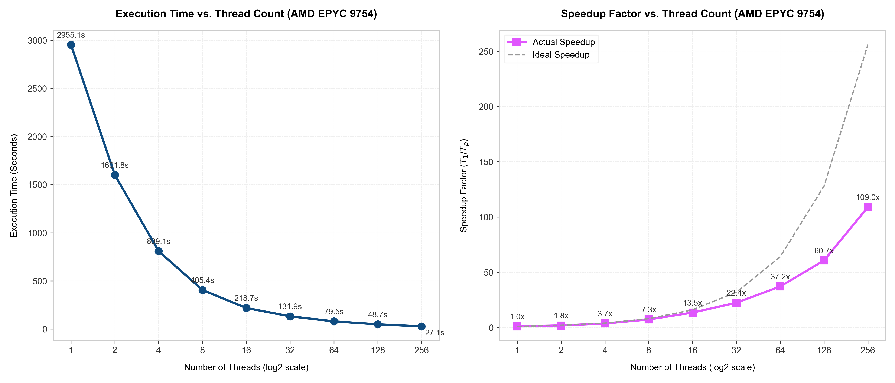
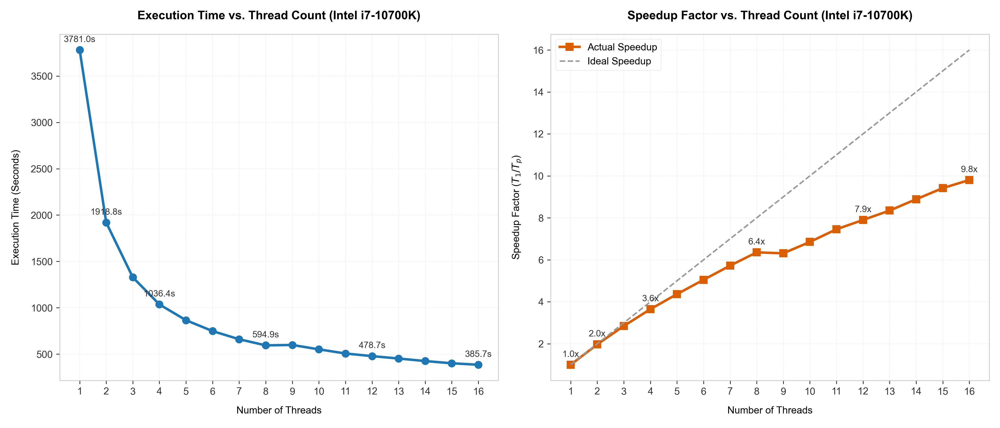

# 🚀 DPC-AKNN Parallelization & Optimization / Song song hóa & Tối ưu hóa DPC-AKNN

**Select Language / Chọn Ngôn ngữ:**  
👉 **[🇺🇸 English Version](#-parallelization-and-optimization-of-the-dpc-aknn-clustering-algorithm-openmp--cuda)** | **[🇻🇳 Bản Tiếng Việt](#-song-song-hóa-và-tối-ưu-hóa-thuật-toán-phân-cụm-dpc-aknn-openmp--cuda)**

---

# 🚀 Parallelization and Optimization of the DPC-AKNN Clustering Algorithm (OpenMP & CUDA)

[](https://en.wikipedia.org/wiki/C99)
[](https://developer.nvidia.com/cuda-zone)
[](https://www.openmp.org/)
[](https://www.python.org/)
[](https://opensource.org/licenses/MIT)

## ℹ️ About the Project
This repository contains the Course Assignment (Bài tập lớn - BTL) for the **Parallel Programming** (Lập trình song song - LTSS) course. The primary objective is to parallelize and optimize the DPC-AKNN (Density Peak Clustering based on Nearest Neighbors) algorithm using OpenMP for multicore CPUs and CUDA C for NVIDIA GPUs to achieve maximum execution efficiency and scalability on large-scale datasets.

This project focuses on the implementation, parallelization, and optimization of the **Density Peak Clustering based on Nearest Neighbors (DPC-AKNN)** algorithm on both multicore CPUs (using **OpenMP**) and GPUs (using **NVIDIA CUDA C**). The implementation is based on the following publication:

> 📄 **Houshen Lin, Jian Hou, Huaqiang Yuan.** *"Density peak clustering based on nearest neighbors"*. Engineering Applications of Artificial Intelligence 160 (2025) 111981.

---

## 📌 Algorithm Overview

DPC-AKNN addresses the key limitations of the traditional Density Peak Clustering (DPC) algorithm:
1. **Adaptive Local Density ($\rho_i$):** Rather than using a global static cutoff distance ($d_c$), DPC-AKNN defines local density using a Gaussian kernel restricted within each point's $k$-nearest neighbors ($k$NN). This minimizes noise from distant clusters.
2. **Iterative Label Reallocation via Linkage Matrix:** DPC-AKNN replaces the traditional one-step label assignment (which suffers from error propagation) with an iterative voting mechanism. It builds a shared Linkage Matrix $A$ and resolves labels using a $k$NN Voting process.

Given that the computational complexity of the algorithm is dominated by the Linkage Matrix update loop ($O(N_c \times N^2)$) and pairwise distance calculations ($O(N^2 \times D)$), parallel execution using **OpenMP** and **CUDA** yields substantial speedups, enabling the processing of large datasets (such as Fashion-MNIST with 70,000 samples).

---

## 📂 Repository Structure

```text
d:/BTL_LTSS/
├── cpu_parallel/                     # CPU Parallel Implementation (C99 + OpenMP)
│   ├── src/                          # C Source Files
│   │   ├── config.h                  # Default parameters and OpenMP configurations
│   │   ├── main.c                    # Application entry point
│   │   ├── dpc_aknn_core.c           # Core DPC-AKNN step-by-step algorithms
│   │   └── ...
│   ├── benchmark/                    # Benchmark scripts and plots
│   │   ├── plot_runtime.py           # Generates CPU runtime and speedup benchmark plots
│   │   ├── epyc_9754_benchmark.png   # Performance plot for AMD EPYC 9754
│   │   └── i7_10700k_benchmark.png   # Performance plot for Intel i7-10700K
│   ├── Makefile                      # Makefile for CPU build
│   ├── readme_win.md                 # Compilation guide for Windows
│   └── readme_linux.md               # Compilation guide for Linux
│
├── gpu_parallel/                     # GPU Parallel Implementation (CUDA C)
│   ├── src/                          # CUDA Source Files
│   │   ├── config.h                  # Default parameters and thread-block dimensions
│   │   ├── main.cu                   # Application entry point
│   │   ├── kernels.cu                # CUDA kernels for distance, kNN, and voting
│   │   └── ...
│   ├── Makefile                      # Makefile for GPU build
│   ├── readme_win.md                 # Compilation guide for Windows
│   └── readme_linux.md               # Compilation guide for Linux
│
├── data/                             # Dataset Storage (CSV)
│   └── real/
│       ├── iris/                     # Iris dataset (150 samples, 3 clusters)
│       └── fashion-mnist/            # Fashion-MNIST dataset (70,000 samples, 10 clusters)
│
├── theory/
│   └── THEORY.md                     # Mathematical details and formula mapping
│
└── README.md                         # This bilingual documentation
```

---

## 💻 Environment Prerequisites

### 1. C/C++ and CUDA Compilers
* **Operating System:** Windows (10/11) or Linux (Ubuntu 20.04+ recommended).
* **CPU Compiler:** `GCC` (with OpenMP support). On Windows, use **MinGW-w64**.
* **GPU Compiler:** `NVCC` (CUDA Toolkit 11.x or 12.x+).
* **MSVC Compiler (Windows host compiler for NVCC):** `cl.exe` from Visual Studio 2022.
* **Build Tool:** `make` (Linux) or `mingw32-make` (Windows).

### 2. Python Environment (for Verification & Visualization)
Install required dependencies:
```bash
pip install numpy matplotlib scikit-learn scipy pandas
```

---

## 🛠️ Compilation & Execution Guides

### 1. CPU Version (OpenMP)
By default, the CPU version is configured to cluster the **Iris** dataset ($N_c = 3, k = 7$).

#### 🔹 Compilation:
* **Windows (PowerShell/CMD with MinGW):**
  ```powershell
  cd cpu_parallel
  mingw32-make clean
  mingw32-make
  ```
* **Linux (Terminal):**
  ```bash
  cd cpu_parallel
  make clean
  make
  ```

#### 🔹 Running:
* **Default execution (Iris dataset):**
  ```bash
  # Windows
  .\dpc_aknn_cpu.exe
  # Linux
  ./dpc_aknn_cpu
  ```
* **Custom execution (Fashion-MNIST example):**
  ```bash
  ./dpc_aknn_cpu --input ../data/real/fashion-mnist/fashion_mnist_X.csv --labels ../data/real/fashion-mnist/fashion_mnist_y.csv --clusters 10 --k 15
  ```

---

### 2. GPU Version (CUDA)
By default, the GPU version is configured to cluster the **Fashion-MNIST** dataset ($N_c = 10, k = 15$).

#### 🔹 Compilation:
* **Windows (Open "Developer PowerShell for VS 2022" to load `cl.exe` into path):**
  ```powershell
  cd gpu_parallel
  mingw32-make clean
  mingw32-make
  ```
* **Linux (Terminal):**
  ```bash
  cd gpu_parallel
  make clean
  make
  ```

#### 🔹 Running:
* **Default execution (Fashion-MNIST):**
  ```bash
  # Windows
  .\dpc_aknn_gpu.exe
  # Linux
  ./dpc_aknn_gpu
  ```
* **Custom execution (Iris example):**
  ```bash
  ./dpc_aknn_gpu --input ../data/real/iris/iris_X_norm.csv --labels ../data/real/iris/iris_y.csv --clusters 3 --k 7
  ```

---

## ⚙️ Configuration Parameters (config.h)

Parameters can be adjusted in `config.h` of the respective implementations:
* **CPU Config ([cpu_parallel/src/config.h](file:///d:/BTL_LTSS/cpu_parallel/src/config.h)):**
  * `DEFAULT_INPUT_FILE` & `DEFAULT_LABEL_FILE`: Input data path.
  * `DEFAULT_N_CLUSTERS`: Number of target clusters.
  * `DEFAULT_K`: Nearest neighbors parameter.
  * `OMP_N_THREADS`: OpenMP threads (`0` uses all available cores).
* **GPU Config ([gpu_parallel/src/config.h](file:///d:/BTL_LTSS/gpu_parallel/src/config.h)):**
  * `GPU_DEVICE_ID`: Select target GPU (default: `0`).
  * `GPU_BATCH_SIZE`: Chunk size to partition matrix operations and fit into VRAM (default: `1000`).
  * `BLOCK_SIZE_1D` & `BLOCK_SIZE_2D_X/Y`: Thread block layout variables.

---

## 📊 Experimental Results & Parallelization Analysis

This section presents a comprehensive evaluation of the parallelized DPC-AKNN algorithm on the **Fashion-MNIST** dataset ($N = 70,000$, $D = 784$, $k = 15$, $N_c = 10$).

### 1. Experimental Setup
* **Processor 1 (Server CPU):** AMD EPYC 9754 (128 Cores, 256 Threads, base clock 2.25 GHz).
* **Processor 2 (Desktop CPU):** Intel Core i7-10700K (8 Cores, 16 Threads, base clock 3.8 GHz, boost up to 5.1 GHz).
* **GPU 1 (Laptop GPU):** NVIDIA GeForce RTX 3060 Laptop GPU (3840 CUDA Cores, 6GB VRAM).
* **GPU 2 (Workstation GPU):** NVIDIA RTX PRO 6000 Blackwell Workstation Edition (4000 AI TOPS, 96GB GDDR7 ECC VRAM).

---

### 2. Step-by-Step Computational Complexity & Parallelization Strategy
The algorithm is split into 8 logical steps. The computational complexity and parallelization strategies for each step are outlined below:

| Step | Algorithm Stage | Sequential Complexity | Parallelization Scheme | Profiling Time Contribution | Notes / Optimization Details |
| :--- | :--- | :--- | :--- | :--- | :--- |
| **Step 1** | Adaptive $k$NN Search | $O(N^2 \cdot D)$ | **[DOMAIN]** OpenMP / CUDA | **High (~60-70% on CPU)** | Pairwise distance calculations. CUDA: Accelerated using `cuBLAS` SGEMM. CPU: Parallelized loop with early distance exit. |
| **Step 2** | Cutoff Distance $d_c$ | $O(N)$ | **[DOMAIN + SERIAL]** CPU Reduction | **Negligible (<0.01%)** | $O(N)$ reduction performed on host. |
| **Step 3a**| Local Density $\rho_i$ | $O(N \cdot k)$ | **[DOMAIN]** OpenMP / CUDA | **Negligible (<0.01%)** | Independent loop over $N$ points. CUDA uses a 1D grid. |
| **Step 3b**| Relative Distance $\delta_i$| $O(N^2)$ | **[DOMAIN]** OpenMP / CUDA | **High (~30% on CPU)** | Minimum distance search. CUDA: cuBLAS segments. CPU: OpenMP dynamic scheduling. |
| **Step 4** | Center Selection | $O(N \log N)$ | **[SERIAL]** Host CPU | **Negligible (<0.01%)** | Point sorting ($\gamma_i = \rho_i \times \delta_i$) executed sequentially. |
| **Step 5** | Core Clustering | $O(N)$ | **[SERIAL]** Host CPU | **Negligible (<0.01%)** | BFS-like propagation from centers. Inherently sequential. |
| **Step 6** | Linkage Matrix $A$ | $O(N \cdot k^2)$ | **[DOMAIN + SERIAL]** OpenMP | **Low (<0.1%)** | Matrix construction parallelized via OpenMP. |
| **Step 7** | kNN Label Voting | $O(N \cdot k)$ | **[DOMAIN]** OpenMP / CUDA | **Low (<0.1%)** | Safe write with double-buffering. |
| **Step 8** | Outlier Reallocation | $O(N)$ | **[DOMAIN]** OpenMP / CUDA | **Negligible (<0.01%)** | Labeling unassigned points. |

---

### 3. CPU Scaling Performance (AMD EPYC 9754 vs. Intel i7-10700K)

Below are the detailed execution times (in seconds) for each thread count configuration under the **optimized version**.

#### 🔹 AMD EPYC 9754 Performance Table
| Threads | Total Time (s) | Step 1 | Step 2 | Step 3a | Step 3b | Step 4 | Step 5 | Step 6 | Step 7 | Step 8 | Speedup |
| :--- | :--- | :--- | :--- | :--- | :--- | :--- | :--- | :--- | :--- | :--- | :--- |
| **1** | 2955.0891 | 1984.592 | 0.001 | 0.003 | 970.378 | 0.012 | 0.027 | 0.052 | 0.023 | 0.000 | 1.00x |
| **2** | 1601.7501 | 1075.749 | 0.001 | 0.001 | 525.888 | 0.012 | 0.028 | 0.051 | 0.019 | 0.000 | 1.84x |
| **4** | 809.0611 | 544.421 | 0.001 | 0.001 | 264.531 | 0.013 | 0.030 | 0.049 | 0.015 | 0.000 | 3.65x |
| **8** | 405.4009 | 272.706 | 0.001 | 0.000 | 132.590 | 0.013 | 0.030 | 0.048 | 0.013 | 0.000 | 7.29x |
| **16**| 218.6517 | 146.836 | 0.000 | 0.001 | 71.712 | 0.012 | 0.029 | 0.049 | 0.012 | 0.000 | 13.51x |
| **32**| 131.8581 | 84.743 | 0.000 | 0.000 | 47.003 | 0.012 | 0.036 | 0.050 | 0.012 | 0.000 | 22.41x |
| **64**| 79.5317 | 47.471 | 0.001 | 0.000 | 31.952 | 0.013 | 0.029 | 0.053 | 0.012 | 0.000 | 37.16x |
| **128**| 48.6835 | 26.063 | 0.001 | 0.000 | 22.509 | 0.013 | 0.030 | 0.057 | 0.011 | 0.000 | 60.70x |
| **256**| **27.1182** | 15.632 | 0.018 | 0.007 | 11.327 | 0.014 | 0.028 | 0.069 | 0.015 | 0.005 | **108.97x** |

#### 🔹 Intel Core i7-10700K Performance Table
| Threads | Total Time (s) | Step 1 | Step 2 | Step 3a | Step 3b | Step 4 | Step 5 | Step 6 | Step 7 | Step 8 | Speedup |
| :--- | :--- | :--- | :--- | :--- | :--- | :--- | :--- | :--- | :--- | :--- | :--- |
| **1** | 3780.9796 | 2561.668 | 0.002 | 0.006 | 1219.158 | 0.017 | 0.032 | 0.069 | 0.028 | 0.000 | 1.00x |
| **2** | 1918.7933 | 1298.332 | 0.001 | 0.003 | 620.318 | 0.018 | 0.032 | 0.067 | 0.022 | 0.000 | 1.97x |
| **3** | 1328.3810 | 900.621 | 0.001 | 0.002 | 427.618 | 0.018 | 0.033 | 0.067 | 0.021 | 0.000 | 2.85x |
| **4** | 1036.3911 | 701.406 | 0.001 | 0.002 | 334.846 | 0.018 | 0.032 | 0.066 | 0.021 | 0.000 | 3.65x |
| **5** | 866.1966 | 578.007 | 0.001 | 0.001 | 288.043 | 0.018 | 0.032 | 0.075 | 0.020 | 0.000 | 4.36x |
| **6** | 748.9263 | 492.012 | 0.000 | 0.001 | 256.767 | 0.018 | 0.033 | 0.076 | 0.019 | 0.000 | 5.05x |
| **7** | 660.6184 | 427.161 | 0.000 | 0.001 | 233.316 | 0.018 | 0.033 | 0.070 | 0.019 | 0.000 | 5.72x |
| **8** | 594.8885 | 378.021 | 0.000 | 0.001 | 216.732 | 0.018 | 0.033 | 0.064 | 0.019 | 0.000 | 6.36x |
| **9** | 599.1490 | 374.506 | 0.000 | 0.001 | 224.506 | 0.018 | 0.033 | 0.065 | 0.019 | 0.000 | 6.31x |
| **10**| 551.8462 | 344.697 | 0.000 | 0.001 | 207.008 | 0.020 | 0.033 | 0.068 | 0.019 | 0.000 | 6.85x |
| **11**| 507.1294 | 313.523 | 0.000 | 0.001 | 193.462 | 0.020 | 0.033 | 0.071 | 0.018 | 0.000 | 7.46x |
| **12**| 478.7060 | 293.630 | 0.000 | 0.001 | 184.936 | 0.019 | 0.033 | 0.067 | 0.018 | 0.000 | 7.90x |
| **13**| 452.9379 | 276.527 | 0.000 | 0.001 | 176.270 | 0.020 | 0.033 | 0.069 | 0.018 | 0.000 | 8.35x |
| **14**| 425.4405 | 255.592 | 0.000 | 0.001 | 169.709 | 0.020 | 0.032 | 0.067 | 0.018 | 0.000 | 8.89x |
| **15**| 401.5139 | 238.926 | 0.000 | 0.001 | 162.444 | 0.020 | 0.033 | 0.072 | 0.018 | 0.000 | 9.42x |
| **16**| **385.6999** | 228.118 | 0.000 | 0.001 | 157.440 | 0.020 | 0.033 | 0.070 | 0.018 | 0.000 | **9.80x** |

#### 🔹 Performance Charts
To visualize scaling behavior, the charts below illustrate Execution Time and Speedup Factors for each CPU configuration:





#### 🔹 Scalability Discussion
* **Amdahl's Law:** The profiling charts verify that **Step 1** (kNN search) and **Step 3b** (delta calculation) occupy **99.9%** of the sequential execution time ($P \approx 0.999$). By parallelizing both domains, the theoretical scaling limit remains high.
* **AMD EPYC 9754 Scaling:** Scalability is almost linear up to 16 threads. Past 32 threads, memory bandwidth bottlenecks begin to restrict speedup scaling. Even so, the 256-thread execution achieves an exceptional speedup of **108.97x** compared to single-thread execution.
* **Intel i7-10700K Scaling:** Scaling behaves cleanly up to 8 threads (its physical cores). Between 9 to 16 threads (Logical processors/Hyper-Threading), speedup improvements continue but slow down, finishing at **9.80x**.

---

### 4. GPU Acceleration & Cross-Device Comparison

The GPU implementation offloads computationally intensive tensor contractions (GEMM) to hardware accelerators using `cuBLAS`.

* **NVIDIA RTX 3060 Laptop GPU:** Total runtime = **2.8508 seconds**
* **NVIDIA RTX PRO 6000 Blackwell:** Total runtime = **0.7316 seconds**

#### 🔹 Architectural Speedup Analysis
Taking the AMD EPYC 9754 CPU (1 Thread) as the baseline for sequential execution, we measure cross-architecture speedups:

$$\text{Speedup} = \frac{T_{\text{EPYC (1 Thread)}}}{T_{\text{GPU}}}$$

* **RTX 3060 Laptop GPU:**
  * Speedup vs. Sequential EPYC CPU: **1036.58x** faster.
  * Speedup vs. Fully Parallelized EPYC CPU (256 Threads): **9.51x** faster.
* **RTX PRO 6000 Blackwell GPU:**
  * Speedup vs. Sequential EPYC CPU: **4039.21x** faster.
  * Speedup vs. Fully Parallelized EPYC CPU (256 Threads): **37.07x** faster.

This extreme acceleration is achieved by mapping **Step 1** ($k$NN) and **Step 3b** ($\delta_i$) onto massive GPU matrix multiplication kernels (GEMM), which run at TFLOPS scales.

---

## 📖 Theoretical Details
For a deeper mathematical dive, formulas, and code mappings, check the theoretical documentation:
👉 [theory/THEORY.md](file:///d:/BTL_LTSS/theory/THEORY.md)

---

# 🚀 Song song hóa và Tối ưu hóa Thuật toán Phân cụm DPC-AKNN (OpenMP & CUDA)

[](https://en.wikipedia.org/wiki/C99)
[](https://developer.nvidia.com/cuda-zone)
[](https://www.openmp.org/)
[](https://www.python.org/)
[](https://opensource.org/licenses/MIT)

## ℹ️ Giới thiệu dự án
Kho lưu trữ này chứa Bài tập lớn (BTL) môn học **Lập trình song song** (LTSS). Mục tiêu chính của dự án là song song hóa và tối ưu hóa thuật toán DPC-AKNN (Density Peak Clustering based on Nearest Neighbors) bằng cách sử dụng OpenMP cho CPU đa nhân và CUDA C cho GPU NVIDIA nhằm đạt hiệu năng thực thi và khả năng mở rộng tối đa trên các bộ dữ liệu lớn.

Dự án tập trung triển khai, song song hóa và tối ưu hóa thuật toán **Density Peak Clustering based on Nearest Neighbors (DPC-AKNN)** trên CPU đa nhân (sử dụng **OpenMP**) và GPU (sử dụng **NVIDIA CUDA C**). Thiết kế được xây dựng dựa trên bài báo khoa học:

> 📄 **Houshen Lin, Jian Hou, Huaqiang Yuan.** *"Density peak clustering based on nearest neighbors"*. Engineering Applications of Artificial Intelligence 160 (2025) 111981.

---

## 📌 Tổng Quan Thuật Toán DPC-AKNN

DPC-AKNN giải quyết các điểm yếu lớn của thuật toán Density Peak Clustering (DPC) truyền thống:
1. **Mật độ cục bộ thích ứng ($\rho_i$):** Thay vì sử dụng khoảng cách cắt tĩnh (cutoff distance) trên toàn cục, DPC-AKNN xác định mật độ bằng nhân Gauss giới hạn trong phạm vi $k$-lân cận gần nhất ($k$NN) của mỗi điểm. Điều này giúp khử nhiễu từ các cụm ở xa.
2. **Gán nhãn lặp qua Ma trận Liên kết:** Thay thế cơ chế gán nhãn một bước dễ tích tụ sai số bằng cơ chế bỏ phiếu dựa trên Ma trận Liên kết $A$ được xây dựng động giữa các láng giềng.

Do độ phức tạp của thuật toán tập trung ở khâu tính ma trận liên kết ($O(N_c \times N^2)$) và khoảng cách pairwise ($O(N^2 \times D)$), việc ứng dụng **OpenMP** và **CUDA** giúp cải thiện đáng kể tốc độ thực thi trên các bộ dữ liệu lớn (như Fashion-MNIST với 70,000 mẫu).

---

## 📂 Cấu Trúc Thư Mục Dự Án

```text
d:/BTL_LTSS/
├── cpu_parallel/                     # Phiên bản song song CPU (C99 + OpenMP)
│   ├── src/                          # Mã nguồn C
│   │   ├── config.h                  # File cấu hình tham số mặc định & OpenMP
│   │   ├── main.c                    # Điểm chạy chương trình chính
│   │   ├── dpc_aknn_core.c           # Mã nguồn các bước lõi của DPC-AKNN
│   │   └── ...
│   ├── benchmark/                    # Mã nguồn vẽ biểu đồ và lưu kết quả đo
│   │   ├── plot_runtime.py           # Script vẽ biểu đồ thời gian và speedup
│   │   ├── epyc_9754_benchmark.png   # Biểu đồ hiệu năng AMD EPYC 9754
│   │   └── i7_10700k_benchmark.png   # Biểu đồ hiệu năng Intel i7-10700K
│   ├── Makefile                      # Makefile cho CPU
│   ├── readme_win.md                 # Hướng dẫn Windows
│   └── readme_linux.md               # Hướng dẫn Linux
│
├── gpu_parallel/                     # Phiên bản song song GPU (CUDA C)
│   ├── src/                          # Mã nguồn CUDA
│   │   ├── config.h                  # File cấu hình luồng và thiết bị GPU
│   │   ├── main.cu                   # Điểm chạy chương trình chính
│   │   ├── kernels.cu                # Các CUDA Kernel xử lý khoảng cách, kNN, bầu chọn
│   │   └── ...
│   ├── Makefile                      # Makefile cho GPU
│   ├── readme_win.md                 # Hướng dẫn Windows
│   └── readme_linux.md               # Hướng dẫn Linux
│
├── data/                             # Dữ liệu thực nghiệm (CSV)
│   └── real/
│       ├── iris/                     # Iris dataset (150 mẫu, 3 cụm)
│       └── fashion-mnist/            # Fashion-MNIST (70,000 mẫu, 10 cụm)
│
├── theory/
│   └── THEORY.md                     # Tài liệu lý thuyết toán học & công thức
│
├── visual/                           # Tiện ích trực quan hóa Python
│   └── visualize_data.py             # Trực quan dữ liệu đầu vào (PCA, t-SNE)
│
└── README.md                         # tệp này
```

---

## 💻 Yêu Cầu Môi Trường

### 1. Trình biên dịch C/C++ và CUDA
* **Hệ điều hành:** Windows (10/11) hoặc Linux (khuyên dùng Ubuntu 20.04+).
* **Trình biên dịch CPU:** `GCC` hỗ trợ OpenMP. Trên Windows sử dụng **MinGW-w64**.
* **Trình biên dịch GPU:** `NVCC` thuộc CUDA Toolkit 11.x hoặc 12.x+.
* **Host Compiler trên Windows:** `cl.exe` đi kèm Visual Studio 2022.
* **Build Tool:** `make` (Linux) hoặc `mingw32-make` (Windows).

### 2. Môi trường Python (để chạy Demo và Đánh giá)
Cài đặt thư viện:
```bash
pip install numpy matplotlib scikit-learn scipy pandas
```

---

## 🛠️ Hướng Dẫn Biên Dịch & Chạy Chương Trình

### 1. Phiên Bản CPU (OpenMP)
Mặc định phân cụm tập **Iris** ($N_c = 3, k = 7$).

#### 🔹 Biên dịch:
* **Windows (PowerShell/CMD với MinGW):**
  ```powershell
  cd cpu_parallel
  mingw32-make clean
  mingw32-make
  ```
* **Linux:**
  ```bash
  cd cpu_parallel
  make clean
  make
  ```

#### 🔹 Chạy chương trình:
* **Mặc định (Iris):**
  ```bash
  # Windows
  .\dpc_aknn_cpu.exe
  # Linux
  ./dpc_aknn_cpu
  ```
* **Chạy dataset tùy chọn (ví dụ: Fashion-MNIST):**
  ```bash
  ./dpc_aknn_cpu --input ../data/real/fashion-mnist/fashion_mnist_X.csv --labels ../data/real/fashion-mnist/fashion_mnist_y.csv --clusters 10 --k 15
  ```

---

### 2. Phiên Bản GPU (CUDA)
Mặc định phân cụm tập **Fashion-MNIST** ($N_c = 10, k = 15$).

#### 🔹 Biên dịch:
* **Windows (Mở "Developer PowerShell for VS 2022"):**
  ```powershell
  cd gpu_parallel
  mingw32-make clean
  mingw32-make
  ```
* **Linux:**
  ```bash
  cd gpu_parallel
  make clean
  make
  ```

#### 🔹 Chạy chương trình:
* **Mặc định (Fashion-MNIST):**
  ```bash
  # Windows
  .\dpc_aknn_gpu.exe
  # Linux
  ./dpc_aknn_gpu
  ```
* **Chạy dataset tùy chọn (ví dụ: Iris):**
  ```bash
  ./dpc_aknn_gpu --input ../data/real/iris/iris_X_norm.csv --labels ../data/real/iris/iris_y.csv --clusters 3 --k 7
  ```

---

## ⚙️ Cấu Hình Tham Số Mặc Định (config.h)

Chỉnh sửa trực tiếp trong tệp `config.h` của từng thư mục:
* **CPU Config ([cpu_parallel/src/config.h](file:///d:/BTL_LTSS/cpu_parallel/src/config.h)):**
  * `DEFAULT_INPUT_FILE` & `DEFAULT_LABEL_FILE`: Đường dẫn file dữ liệu.
  * `DEFAULT_N_CLUSTERS`: Số cụm.
  * `DEFAULT_K`: Láng giềng kNN.
  * `OMP_N_THREADS`: Số luồng (`0` để dùng toàn bộ CPU core).
* **GPU Config ([gpu_parallel/src/config.h](file:///d:/BTL_LTSS/gpu_parallel/src/config.h)):**
  * `GPU_DEVICE_ID`: Device ID của GPU card.
  * `GPU_BATCH_SIZE`: Phân cụm nhỏ ma trận để không tràn VRAM (mặc định: `1000`).
  * `BLOCK_SIZE_1D` & `BLOCK_SIZE_2D_X/Y`: Cấu hình thread block của CUDA.

---

## 📊 Kết Quả Thực Nghiệm & Phân Tích Song Song Hóa

Phần này phân tích hiệu năng thực thi song song thuật toán trên tập dữ liệu **Fashion-MNIST** ($N = 70000$, $D = 784$, $k = 15$, $N_c = 10$).

### 1. Thiết lập thực nghiệm
* **CPU Server:** AMD EPYC 9754 (128 Cores, 256 Threads, xung nhịp cơ bản 2.25 GHz).
* **CPU Desktop:** Intel Core i7-10700K (8 Cores, 16 Threads, xung nhịp cơ bản 3.8 GHz).
* **GPU Laptop:** NVIDIA GeForce RTX 3060 Laptop (3840 CUDA Cores, 6GB VRAM).
* **GPU Workstation:** NVIDIA RTX PRO 6000 Blackwell Workstation Edition (4000 AI TOPS, 96GB GDDR7 ECC VRAM).

---

### 2. Phân Tích Độ Phức Tạp & Chiến Lược Song Song Hóa Từng Bước
Dưới đây là bảng phân tích chi tiết cho 8 bước của thuật toán DPC-AKNN:

| Bước | Tên Giai Đoạn | Độ Phức Tạp Tuần Tự | Cơ Chế Song Song Hóa | Tỷ Trọng Thời Gian Chạy | Ghi Chú / Chi Tiết Tối Ưu Hóa |
| :--- | :--- | :--- | :--- | :--- | :--- |
| **Bước 1** | Tìm kiếm láng giềng $k$NN | $O(N^2 \cdot D)$ | **[DOMAIN]** OpenMP / CUDA | **Rất cao (~60-70% trên CPU)**| Tính khoảng cách pairwise. GPU tăng tốc bằng `cuBLAS` SGEMM. CPU song song hóa vòng lặp lớn kết hợp kỹ thuật cắt sớm khoảng cách. |
| **Bước 2** | Tính d_c thích ứng | $O(N)$ | **[DOMAIN + SERIAL]** Reduction | **Rất nhỏ (<0.01%)** | Thực hiện trên Host CPU do chỉ tính trung bình cộng đơn giản. |
| **Bước 3a**| Tính mật độ cục bộ $\rho$ | $O(N \cdot k)$ | **[DOMAIN]** OpenMP / CUDA | **Rất nhỏ (<0.01%)** | Tính mật độ Gauss độc lập cho mỗi điểm. CUDA sử dụng lưới 1D. |
| **Bước 3b**| Tính khoảng cách $\delta$ | $O(N^2)$ | **[DOMAIN]** OpenMP / CUDA | **Cao (~30% trên CPU)** | Tìm điểm mật độ cao hơn gần nhất. GPU dùng phân đoạn cuBLAS. CPU dùng OpenMP với dynamic scheduling. |
| **Bước 4** | Chọn tâm cụm | $O(N \log N)$ | **[SERIAL]** Host CPU | **Rất nhỏ (<0.01%)** | Sắp xếp mảng tích $\gamma = \rho \times \delta$ để chọn $N_c$ tâm cụm, chạy tuần tự trên CPU. |
| **Bước 5** | Tạo cụm nòng cốt (BFS) | $O(N)$ | **[SERIAL]** Host CPU | **Rất nhỏ (<0.01%)** | Loang BFS nhãn từ tâm cụm. Mang tính tuần tự cao, thực thi trên Host CPU. |
| **Bước 6** | Ma trận liên kết $A$ | $O(N \cdot k^2)$ | **[DOMAIN + SERIAL]** OpenMP | **Thấp (<0.1%)** | Tính toán ma trận lặp được song song hóa trên CPU. |
| **Bước 7** | Bầu chọn sửa lỗi | $O(N \cdot k)$ | **[DOMAIN]** OpenMP / CUDA | **Thấp (<0.1%)** | Dùng cơ chế double-buffer tránh race condition khi bầu chọn. |
| **Bước 8** | Vét cạn ngoại lai | $O(N)$ | **[DOMAIN]** OpenMP / CUDA | **Rất nhỏ (<0.01%)** | Gán nhãn cho các điểm nhiễu còn lại. |

---

### 3. Đánh Giá Khả Năng Tăng Tốc CPU (AMD EPYC 9754 vs. Intel i7-10700K)

Bảng tổng hợp thời gian thực thi (giây) chi tiết theo luồng chạy phiên bản **optimized**.

#### 🔹 Bảng thời gian trên AMD EPYC 9754
| Threads | Tổng thời gian (s) | Bước 1 | Bước 2 | Bước 3a | Bước 3b | Bước 4 | Bước 5 | Bước 6 | Bước 7 | Bước 8 | Speedup |
| :--- | :--- | :--- | :--- | :--- | :--- | :--- | :--- | :--- | :--- | :--- | :--- |
| **1** | 2955.0891 | 1984.592 | 0.001 | 0.003 | 970.378 | 0.012 | 0.027 | 0.052 | 0.023 | 0.000 | 1.00x |
| **2** | 1601.7501 | 1075.749 | 0.001 | 0.001 | 525.888 | 0.012 | 0.028 | 0.051 | 0.019 | 0.000 | 1.84x |
| **4** | 809.0611 | 544.421 | 0.001 | 0.001 | 264.531 | 0.013 | 0.030 | 0.049 | 0.015 | 0.000 | 3.65x |
| **8** | 405.4009 | 272.706 | 0.001 | 0.000 | 132.590 | 0.013 | 0.030 | 0.048 | 0.013 | 0.000 | 7.29x |
| **16**| 218.6517 | 146.836 | 0.000 | 0.001 | 71.712 | 0.012 | 0.029 | 0.049 | 0.012 | 0.000 | 13.51x |
| **32**| 131.8581 | 84.743 | 0.000 | 0.000 | 47.003 | 0.012 | 0.036 | 0.050 | 0.012 | 0.000 | 22.41x |
| **64**| 79.5317 | 47.471 | 0.001 | 0.000 | 31.952 | 0.013 | 0.029 | 0.053 | 0.012 | 0.000 | 37.16x |
| **128**| 48.6835 | 26.063 | 0.001 | 0.000 | 22.509 | 0.013 | 0.030 | 0.057 | 0.011 | 0.000 | 60.70x |
| **256**| **27.1182** | 15.632 | 0.018 | 0.007 | 11.327 | 0.014 | 0.028 | 0.069 | 0.015 | 0.005 | **108.97x** |

#### 🔹 Bảng thời gian trên Intel Core i7-10700K
| Threads | Tổng thời gian (s) | Bước 1 | Bước 2 | Bước 3a | Bước 3b | Bước 4 | Bước 5 | Bước 6 | Bước 7 | Bước 8 | Speedup |
| :--- | :--- | :--- | :--- | :--- | :--- | :--- | :--- | :--- | :--- | :--- | :--- |
| **1** | 3780.9796 | 2561.668 | 0.002 | 0.006 | 1219.158 | 0.017 | 0.032 | 0.069 | 0.028 | 0.000 | 1.00x |
| **2** | 1918.7933 | 1298.332 | 0.001 | 0.003 | 620.318 | 0.018 | 0.032 | 0.067 | 0.022 | 0.000 | 1.97x |
| **3** | 1328.3810 | 900.621 | 0.001 | 0.002 | 427.618 | 0.018 | 0.033 | 0.067 | 0.021 | 0.000 | 2.85x |
| **4** | 1036.3911 | 701.406 | 0.001 | 0.002 | 334.846 | 0.018 | 0.032 | 0.066 | 0.021 | 0.000 | 3.65x |
| **5** | 866.1966 | 578.007 | 0.001 | 0.001 | 288.043 | 0.018 | 0.032 | 0.075 | 0.020 | 0.000 | 4.36x |
| **6** | 748.9263 | 492.012 | 0.000 | 0.001 | 256.767 | 0.018 | 0.033 | 0.076 | 0.019 | 0.000 | 5.05x |
| **7** | 660.6184 | 427.161 | 0.000 | 0.001 | 233.316 | 0.018 | 0.033 | 0.070 | 0.019 | 0.000 | 5.72x |
| **8** | 594.8885 | 378.021 | 0.000 | 0.001 | 216.732 | 0.018 | 0.033 | 0.064 | 0.019 | 0.000 | 6.36x |
| **9** | 599.1490 | 374.506 | 0.000 | 0.001 | 224.506 | 0.018 | 0.033 | 0.065 | 0.019 | 0.000 | 6.31x |
| **10**| 551.8462 | 344.697 | 0.000 | 0.001 | 207.008 | 0.020 | 0.033 | 0.068 | 0.019 | 0.000 | 6.85x |
| **11**| 507.1294 | 313.523 | 0.000 | 0.001 | 193.462 | 0.020 | 0.033 | 0.071 | 0.018 | 0.000 | 7.46x |
| **12**| 478.7060 | 293.630 | 0.000 | 0.001 | 184.936 | 0.019 | 0.033 | 0.067 | 0.018 | 0.000 | 7.90x |
| **13**| 452.9379 | 276.527 | 0.000 | 0.001 | 176.270 | 0.020 | 0.033 | 0.069 | 0.018 | 0.000 | 8.35x |
| **14**| 425.4405 | 255.592 | 0.000 | 0.001 | 169.709 | 0.020 | 0.032 | 0.067 | 0.018 | 0.000 | 8.89x |
| **15**| 401.5139 | 238.926 | 0.000 | 0.001 | 162.444 | 0.020 | 0.033 | 0.072 | 0.018 | 0.000 | 9.42x |
| **16**| **385.6999** | 228.118 | 0.000 | 0.001 | 157.440 | 0.020 | 0.033 | 0.070 | 0.018 | 0.000 | **9.80x** |

#### 🔹 Biểu đồ phân tích hiệu năng
Các biểu đồ dưới đây mô tả sự thay đổi của Thời gian chạy (Execution Time) và Hệ số tăng tốc (Speedup Factor) đối với từng CPU:


#### 🔹 Thảo luận về khả năng mở rộng
* **Định luật Amdahl:** Thực nghiệm chứng minh **Bước 1** (kNN) và **Bước 3b** (delta) chiếm **99.9%** thời gian chạy tuần tự ($P \approx 0.999$). Việc song song hóa triệt để 2 phân vùng này giúp bảo toàn hiệu năng tăng tốc ở số luồng cực lớn.
* **AMD EPYC 9754:** Tăng tốc gần như tuyến tính tuyệt hảo lên tới 16 luồng. Từ 32 luồng trở đi, nghẽn băng thông bộ nhớ RAM bắt đầu làm suy giảm độ dốc tăng tốc. Tuy nhiên, ở luồng cực đại (256 threads), hệ thống đạt độ tăng tốc cực kỳ ấn tượng là **108.97x**.
* **Intel i7-10700K:** Khả năng tăng tốc tuyến tính khá tốt tới 8 luồng (số lõi vật lý). Từ 9 đến 16 luồng (Logical processors/Hyper-Threading), hiệu năng tăng chậm lại nhưng vẫn đạt đỉnh ở **9.80x**.

---

### 4. Tăng Tốc Bằng GPU & So Sánh Thiết Bị

Mã CUDA trên GPU tận dụng các hàm tối ưu hóa đại số tuyến tính của thư viện `cuBLAS`.

* **NVIDIA RTX 3060 Laptop GPU:** Tổng thời gian = **2.8508 giây**
* **NVIDIA RTX PRO 6000 Blackwell:** Tổng thời gian = **0.7316 giây**

#### 🔹 Phân tích so sánh tăng tốc
Lấy cấu hình chạy đơn luồng CPU AMD EPYC 9754 làm mốc so sánh cơ sở ($T_{\text{EPYC (1 luồng)}} = 2955.09\text{ s}$):

$$\text{Speedup} = \frac{T_{\text{EPYC (1 luồng)}}}{T_{\text{GPU}}}$$

* **GPU RTX 3060 Laptop:**
  * Nhanh gấp **1036.58x** so với EPYC 1 luồng.
  * Nhanh gấp **9.51x** so với EPYC chạy song song tối đa (256 luồng).
* **GPU RTX PRO 6000 Blackwell:**
  * Nhanh gấp **4039.21x** so với EPYC 1 luồng.
  * Nhanh gấp **37.07x** so với EPYC chạy song song tối đa (256 luồng).

Gia tốc đột biến này có được là nhờ việc ánh xạ các phép nhân ma trận dày đặc của **Bước 1** và **Bước 3b** lên các nhân CUDA chuyên dụng, tận dụng tối đa hàng nghìn TFLOPS năng lực tính toán song song phần cứng của GPU.

---

## 📖 Chi Tiết Toán Học & Triển Khai
Để xem chi tiết hơn về các công thức toán học và cách ánh xạ mã nguồn C/CUDA, vui lòng truy cập:
👉 [theory/THEORY.md](file:///d:/BTL_LTSS/theory/THEORY.md)

</details>
